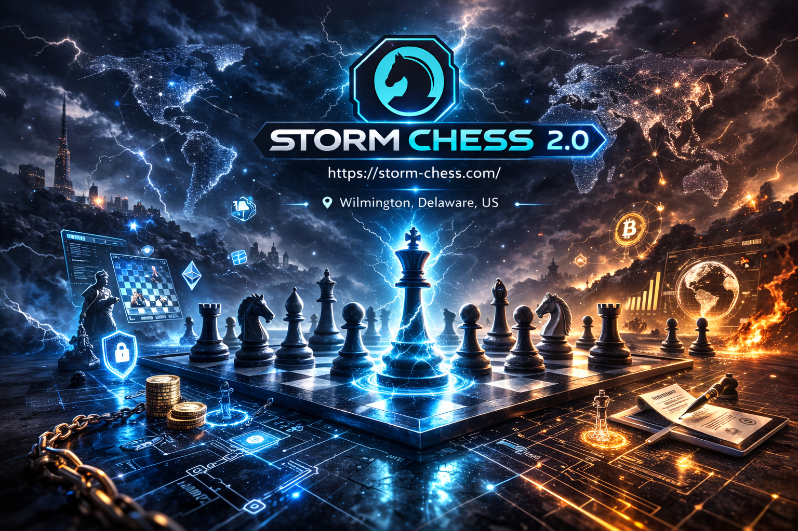
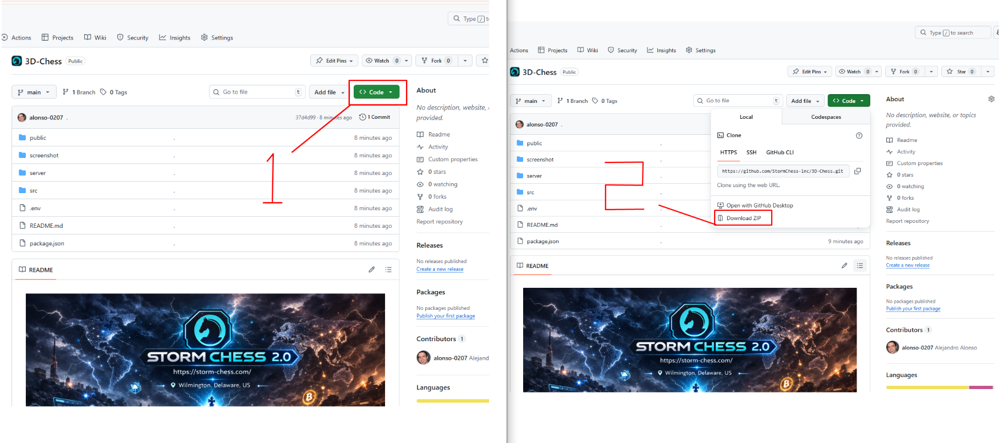

## 🛠️ **Guide for setting up the 3D-Chess Game project**


### ✅ **Step 1: Download Node.js and Install it** 

👉 https://nodejs.org/en/download 

**Screenshot for reference:**  


---

### ✅ **Step 2: Download the Project**

   👉 https://github.com/StormChess-lnc/3D-Chess


   **Screenshot for reference:**  


---

### ✅ **Step 3: On the **Downloads**:**

   📌 Extract downloaded project( `.zip` file )

   📌 Replace extracted folder(directory) name to `chess`

   📌 Open Terminal 
      
   - MacOS ( type `Command(⌘) + Space` → type `terminal` → type `Enter` )
   - Windows ( type `Win + R` → type `cmd` → type `Enter` )

   📌 Navigate to the Project Directory on Terminal

   ```bash
   cd ~/Downloads/chess
   ```
   📌Install Project Dependencies ( This will take time 1~2 minutes )

   ```bash
   /Downloads/chess>npm install
   ```
   📌 Start the Project

   ```bash
   /Downloads/chess>npm start
   ```

---

### 👍 That’s it! The project should now be running successfully

---

